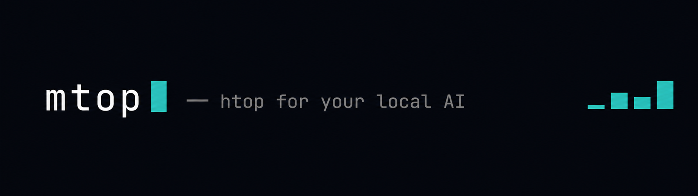
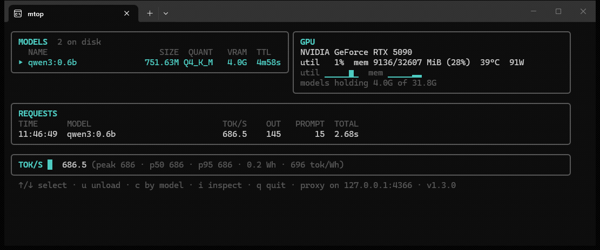

mtop watches whatever you're running locally — Ollama, llama.cpp, LM Studio, vLLM — in one terminal window: loaded models and the VRAM they hold, the GPU, every request with its tok/s, and a throughput sparkline with percentiles. Press `c` to see stats per model instead of per request.

It also unloads models that overstay. Select one, press `u`, it's gone. Ollama is supposed to evict models on its own, but anyone who's run it for a while has seen `ollama ps` showing a model that expired ten minutes ago still sitting on 8 gigs. mtop marks those as overdue, and `-idle-unload 15m` evicts them without asking.

## Install

Grab a binary from [releases](https://github.com/eladser/mtop/releases), or:

```
go install github.com/eladser/mtop@latest
```

Then run `mtop`. It finds whatever servers are up on their usual ports, no config.

## Seeing requests

Local AI servers mostly don't expose per-request metrics — the numbers only exist inside the response stream. So mtop runs a small pass-through proxy on `127.0.0.1:4321` and reads them on the way through. Point your client at it:

```
OLLAMA_HOST=127.0.0.1:4321          # ollama clients
base_url = "http://127.0.0.1:4321/v1"   # openai-style clients
```

The stream reaches your client byte-for-byte. By default the proxy forwards to ollama; use `-target` to put it in front of llama.cpp or LM Studio instead. Models and GPU need zero setup either way.

The same port serves `/metrics` in prometheus format, if you want any of this in grafana.

## Keys

| key | does |
|-----|------|
| `↑`/`↓` or `k`/`j` | select a model |
| `u` | unload it now |
| `c` | per-model stats / recent requests |
| `q` | quit |

## Flags

```
-ollama       ollama base url             (default http://127.0.0.1:11434)
-llamacpp     llama.cpp server url        (default http://127.0.0.1:8080, empty to skip)
-lmstudio     lm studio url               (default http://127.0.0.1:1234, empty to skip)
-vllm         vllm url                    (default http://127.0.0.1:8000, empty to skip)
-listen       proxy listen address        (default 127.0.0.1:4321)
-target       proxy upstream              (defaults to the ollama url)
-idle-unload  unload models with no traffic for this long, e.g. 15m (default off)
-no-proxy     don't run the proxy
```

Each flag also reads an `MTOP_*` env var, and `~/.mtop.conf` can hold those for hosts you don't want to retype:

```
MTOP_OLLAMA=http://homelab:11434
```

## FAQ

**Does the proxy slow my requests down?**
No. Bytes are forwarded as they arrive; the numbers get read out of the stream on the way through. Your client sees the same response at the same speed.

**The requests pane says "none yet".**
Your client is talking to the server directly. Point it at the proxy — that's the only part that needs anything from you. Models and GPU work regardless.

**A model shows "overdue". What is that?**
Ollama said it would unload it at a certain time and didn't. Press `u`, or run with `-idle-unload` and stop thinking about it.

**llama.cpp shows up but with less detail than ollama.**
Start it with `--metrics` (and `--slots` if you want slot info) — without those flags it only exposes the model name.

**What about AMD and Macs?**
AMD works if `rocm-smi` is installed. On Apple Silicon you get unified-memory numbers; real GPU utilization comes from `powermetrics`, which macOS only gives to root, so that's still on the list.

**Why is tok/s different between ollama and openai-style requests?**
Ollama reports its own generation timings, so that number is pure decode speed. OpenAI-style responses don't carry timings, so mtop divides tokens by wall time — prompt processing included. Close, but not the same thing.

**Is anything sent anywhere?**
No. No telemetry, no accounts. The only network calls are to your own servers.

[MIT](LICENSE)
